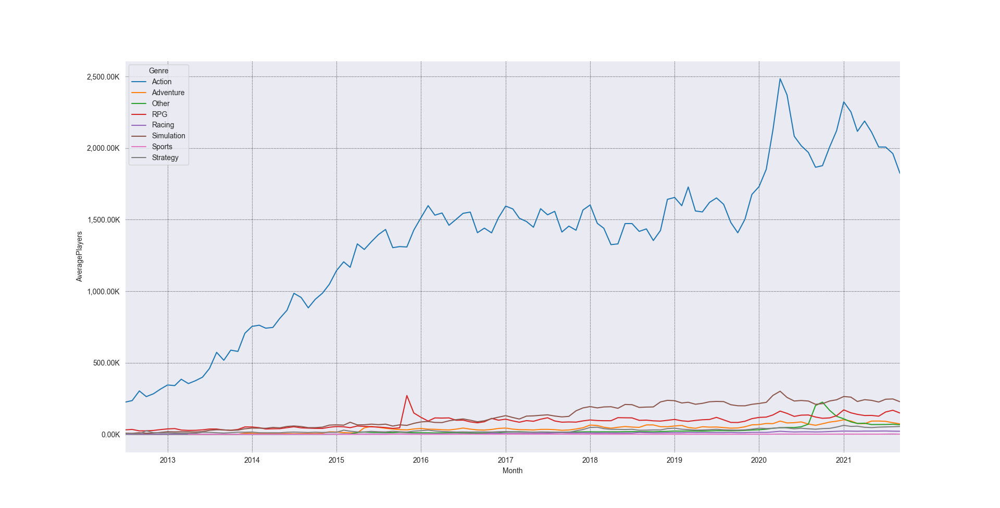
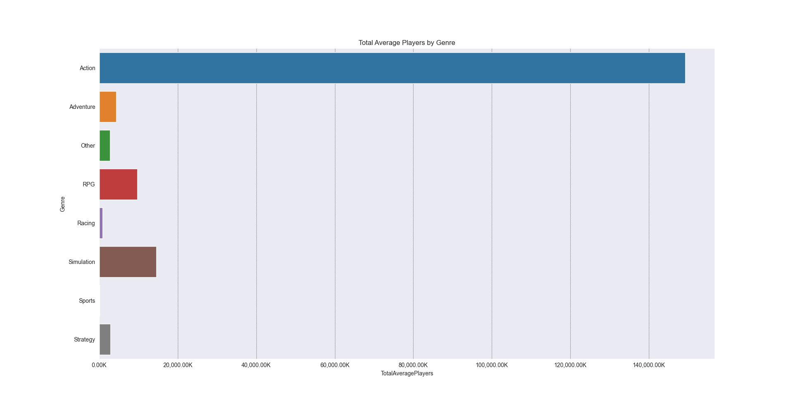
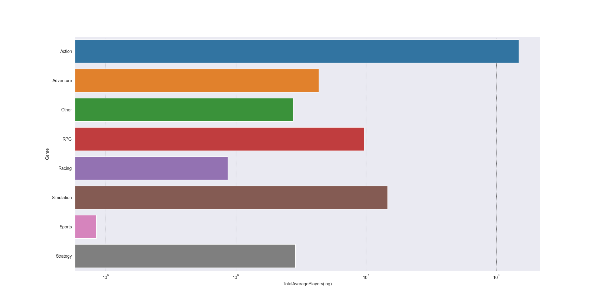
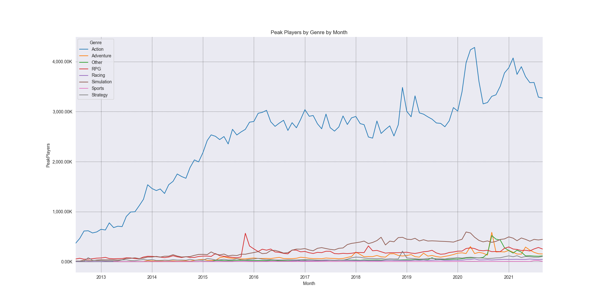
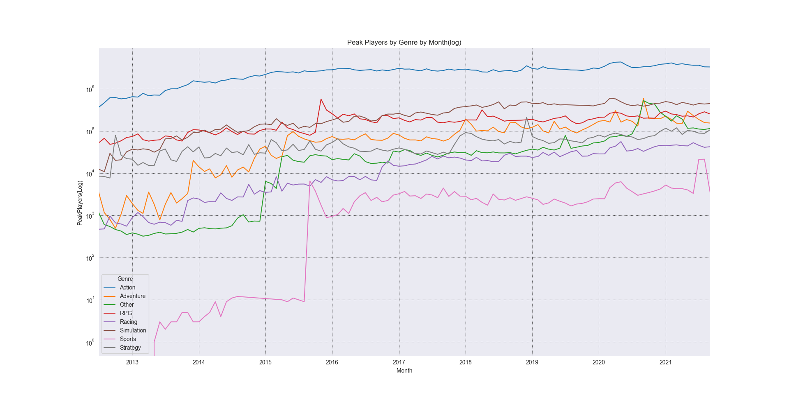
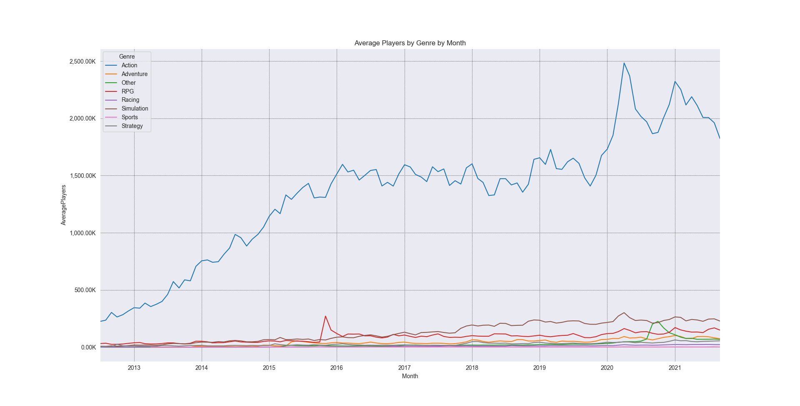
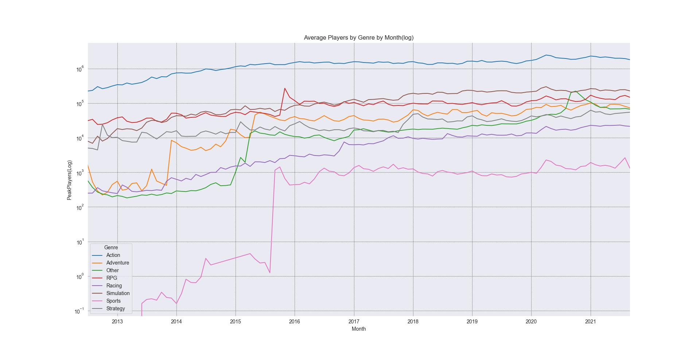

## Data Analysis of Steam(PC) Player Counts by Genres 
### Overview

My goal for this project is to analyze genres by their player counts to see which genre is the most successful. To do this, I decided to focus using datasets that are based on Steam, a computer gaming service. While it does not include mobile or console systems, PC gaming is very popular so I believe it is a good sample to draw conclusions from. Using those datasets I then use python and python libraries like pandas, pandasql, pyplot and seaborn to achieve the desired analysis and visualization.

###Data
```
Datasets:
steam_charts.csv - This dataset was obtained from the website Kaggle. The dataset contains about 52337 rows in total. Each row contains the Game name, the number of average players and peak players, the month the row was recorded on, the gains recorded and the gain percentage compared to last to last month's gains. For my project only the Game name, the number of average players and peak players and the month are relevant.
steam.csv - This dataset was obtained from the website Kaggle. The dataset contains about 27076 rows in total. This particular dataset contains multiple columns, such as appid, name, release_date, english, developer, publisher, platforms, required_age, catagories, genres, steamspy_tags, achievements and more. For my project only two columns are relevant, genres and name. 
```
### Analysis
Analyzed the total average/peak players and the average/peak players over months(from 2012 to 2021)in Steam in 8 different genres:
```
Action- Emphasizes physical challenges and battling enemies with weapons/tools.
Adventure- Emphasizes a story focused approach driven by exploration and puzzle solving.
Other- Games that don't neatly fit into other genres - usually experimental indie games.
RPG- Emphasizes character development of a single or multiple player controlled characters in a immersive world.
Racing- Emphasizes racing competitions in real or fictional worlds.
Simulation- Video games that attempt to closely mirror real life activities.
Sports- Emphasizes the practice of sports.
Strategy- Emphasizes planning and managing a group in a usually non-first person setting.
```

### Visualization(WIP)
















### Citations 
```
Datasets:

https://www.kaggle.com/jackogozaly/steam-player-data 
https://www.kaggle.com/nikdavis/steam-store-games
```
