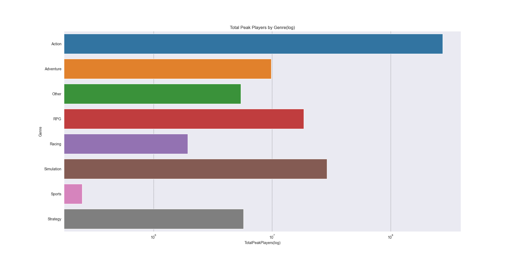

## Data Analysis of Steam(PC) Player Counts by Genres 

### Overview

My goal for this project is to analyze genres by their player counts to see which genre is the most successful. To do this, I decided to focus using datasets that are based on Steam, a computer gaming service. While it does not include mobile or console systems, PC gaming is very popular so I believe it is a good sample to draw conclusions from. Using those datasets I then use python and python libraries like pandas, pandasql, pyplot and seaborn to achieve the desired analysis and visualization.

### Data
Datasets:

steam_charts.csv - This dataset was obtained from the website Kaggle. The dataset contains about 52337 rows in total. Each row contains the Game name, the number of average players and peak players, the month the row was recorded on, the gains recorded and the gain percentage compared to last to last month's gains. For my project only the Game name, the number of average players and peak players and the month are relevant.

steam.csv - This dataset was obtained from the website Kaggle. The dataset contains about 27076 rows in total. This particular dataset contains multiple columns, such as appid, name, release_date, english, developer, publisher, platforms, required_age, catagories, genres, steamspy_tags, achievements and more. For my project only two columns are relevant, genres and name. 

### Analysis
Analyzed the total average/peak players and the average/peak players over months(from 2012 to 2021)in Steam in 8 different genres:
```
Action- Emphasizes physical challenges and battling enemies with weapons/tools.
Adventure- Emphasizes a story focused approach driven by exploration and puzzle solving.
Other- Games that don't neatly fit into other genres - usually experimental indie games.
RPG- Emphasizes character development of a single or multiple player controlled characters in a immersive world.
Racing- Emphasizes racing competitions in real or fictional worlds.
Simulation- Video games that attempt to closely mirror real life activities.
Sports- Emphasizes the practice of sports.
Strategy- Emphasizes planning and managing a group in a usually non-first person setting.
```

### Technique
By using pandasql, the two datasets are joined together through steam_charts 'Game' and steam 'name', selecting Game, Month, Avg. Players, and Peak Players from steam_charts and selecting genres from steam. I then clean up the data dropping rows that don't fit like rows that has "Last 30 Days as their month and applying datetime to 'Month' in YYYY-MM-DD format. Month is now used to Continuing with the clean up some columns are aliased like "Avg. Players" is now AveragePlayers and a helper function is used to clean up genres removing redundant genres that were too specific or vague. To begin with the analysis, four functions were created. To obtain the player count of average players over months, panda aggregate functions are used, summing 'AveragePlayers' and grouping it by their Genre and Month. To obtain the player count of peak players over months, a similar function is used where instead of summing 'AveragePlayers' it is summing 'PeakPlayers'. To obtain the total player count of average players and peak players a pandasql query is used, selecting SUM(AveragePlayers) as TotalAveragePlayers and SUM(PeakPlayers) as TotalPeakPlayers which are then grouped by Genre. The visualization of these functions are shown below.




Here we can see on the normal TotalPeakPlayer bargraph and the log scaled bargraph, action holds the highest amount of peak players by a wide margin. Simulation is a distant second and RPG in third place. The rest of the genres' peak player sizes are comparatively small, which is illustrative of how dominant the action genre is.


The TotalAveragePlayers bargraphs follows similarly to the TotalPeakPlayers bargraphs. It confirms that action maintains the highest player count out of all the genres.


The Peak Players logscaled and normal lineplots show how each genre maintains(and grow) the player count over the months, from a 2012-2021 period. Once again action takes the first spot having the highest player count in each month, and by the log scaled line plot having a steady growth. Though generally, it appears that most genres's player count are growing, with noticable spikes. 


The Average Players lineplots also follow a similar pattern to the Peak Players lineplots, drawing the same conclusions with each genres. 

All in all, my analysis of these visualizations shows that genres are growing, most not dropping below their initial 2012 numbers by 2021. However action noticably has the healthiest and largest player count out of all the genres. 

### Citations 
```
Datasets:

https://www.kaggle.com/jackogozaly/steam-player-data 
https://www.kaggle.com/nikdavis/steam-store-games

Resources:

https://www.w3schools.com/sql/
https://pandas.pydata.org/docs/reference/frame.html
https://seaborn.pydata.org/api.html
```
