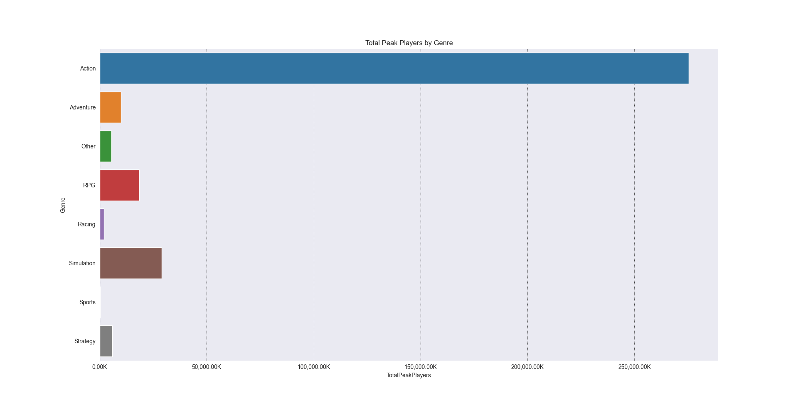

## Data Analysis of Steam(PC) Player Counts by Genres 
### Description

To figure out which video game genres that players are more interested in to give an idea for developers which genre they should choose. My solution is to pick a genre that appears to have a healthy amount of average and peak players that are interested in the genre.

### Markdown

Markdown is a lightweight and easy-to-use syntax for styling your writing. It includes conventions for

```markdown
Syntax highlighted code block

# Header 1
## Header 2
### Header 3

- Bulleted
- List

1. Numbered
2. List

**Bold** and _Italic_ and `Code` text

[Link](url) and 

```
# Test



For more details see [Basic writing and formatting syntax](https://docs.github.com/en/github/writing-on-github/getting-started-with-writing-and-formatting-on-github/basic-writing-and-formatting-syntax).

